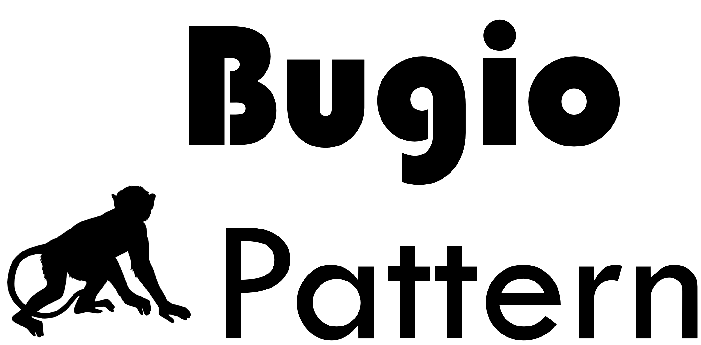
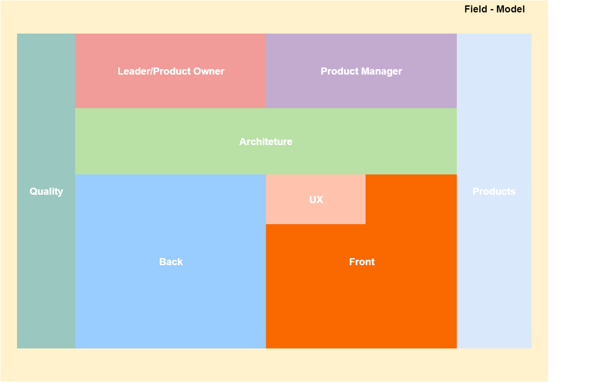
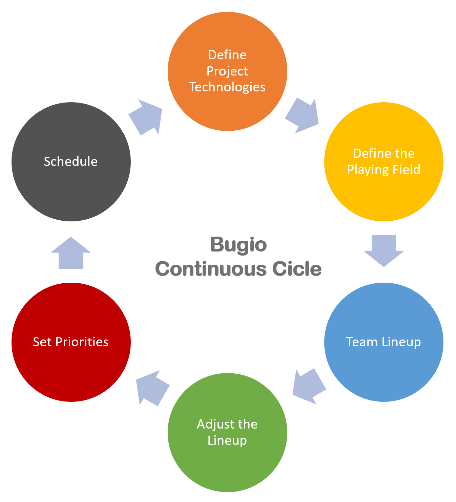

# bugio-pattern
Bugio is a proposed field-based development management framework model. The idea is to define a field with the necessary functions to achieve the project objective (s) and to position (scale) people according to their knowledge continuously.

# The Bugio strategy 
It is common for teams segregated by projects or features to have instances of overload or idle moments, as it is not uncommon to have people with great knowledge of some specific technology working on a particular project to be used on another project. 
Bugio aims to identify the core knowledge of each contributor so that the Product Owner / Product Manager can chosen him into the best project / sprint of the moment. 
In today's fast and easy access to information, it is normal for a collaborator to acquire new knowledge over time regardless of what role he or she may play. Bugio allows you to align this knowledge perspective of each employee on a quarterly basis, so you can make level changes and promote him. 
This Pattern does not do away with methodologies, as it is a team management model and depends on a methodology to reach the objectives. It works great with Scrum, but works best when a project manager is added

# Pattern Papers
[English Version](./Bugio Pattern-EN.pdf)
[Portuguese Version](./Bugio Pattern-pt_BR.pdf)

# Sumary
A lot of information can be obtained in training, books and papers, but the path to be followed is the decision of the manager. Bugio is one of the many paths, which has been in practice for many years and included hundreds of teams. It is a practical path, that is fun to work with and which works. 
